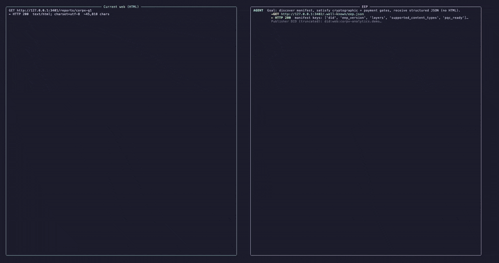

# Entity Engagement Protocol (EEP)

> **An open standard for push-based, verifiable communication between digital entities and the clients that follow them.**

[](./docs/current/SPECIFICATION.md)
[](https://cloudevents.io)
[](./LICENSE)
[](./CODE_OF_CONDUCT.md)
[](./docs/current/SPECIFICATION.md)

<p align="center">
  
</p>
<p align="center"><sub>Two agent paths, side by side. Deterministic — no LLM spend. <a href="./realworld-simulation/">Reproduce it →</a></sub></p>

## Stability (v0.1)

The specification and reference packages are **v0.1**: the spec, schemas, CI and libraries here are meant to be implemented against, but **breaking changes can still happen** while the ecosystem is small. Pin versions in production and read [CHANGELOG.md](./CHANGELOG.md) before upgrades. Governance details: [GOVERNANCE.md](./GOVERNANCE.md).

**Community and safety:** [Code of Conduct](./CODE_OF_CONDUCT.md) · [Security](./SECURITY.md) (reports: **hello@eep.dev** with `[Security]` in the subject) · [Releasing](./RELEASING.md) (maintainers)

## Origins

EEP grew out of engineering work at [more.md](https://more.md), where the team built a platform around the idea of one canonical URL per digital entity. Once the protocol stabilized, it was extracted from that codebase, generalized and open-sourced under Apache 2.0 so any publisher and any agent can speak the same wire format. The more.md team continues to maintain the specification alongside the rest of the core team listed in [GOVERNANCE.md](./GOVERNANCE.md) and operates the production reference implementation that exercises every conformance tier and gate type defined here.

## EEP?

MCP, A2A, webhooks and ActivityPub standards solve different problems. EEP composes with all of them.

- **MCP** lets an LLM *call a tool*. EEP lets an LLM *follow an entity over time* — discover it, subscribe and react to verified events from it.
- **A2A** lets two agents *collaborate on a task*. EEP defines how either agent learns that an entity changed at all.
- **Plain webhooks** require a custom protocol per publisher (auth, signing, retries, replay window). EEP is one wire format with HMAC-signed delivery, SSE and a 60-second replay window — implemented once, reusable everywhere.
- **ActivityPub** federates accounts in a social graph. EEP delivers state-change events from any entity (person org, agent, product, listing) to authorized subscribers, with optional payment / credential / identity gates.
- **DIDs and Verifiable Credentials** identify *who* an entity is. EEP defines *what they tell their subscribers* and *how subscribers verify it*.

If you are building anything labelled "agentic," EEP is the missing layer between *the agent knows about the world* (DIDs, MCP, your data store) and *the agent reacts when the world changes* (today: bespoke per-vendor integrations).

## Official repositories

- Protocol and reference code: [github.com/eep-dev/EEP](https://github.com/eep-dev/EEP)
- Landing site: [github.com/eep-dev/eep-site](https://github.com/eep-dev/eep-site)

## In this repository

If you are deciding whether to star, fork or integrate, here is what is actually here:

| Artifact | Where |
|----------|--------|
| Normative protocol (v0.1) | [docs/current/SPECIFICATION.md](./docs/current/SPECIFICATION.md) |
| JSON Schemas | [schemas/v0.1/](./schemas/v0.1/) |
| TypeScript libraries (`@eep-dev/*`) | [packages/@eep-dev/](./packages/@eep-dev/) |
| Python ports (`eep-*`) | [packages/eep-*-python/](./packages/) (same scope names, Python packaging) |
| Conformance runner | [`@eep-dev/compliance-cli`](./packages/@eep-dev/compliance-cli/) |
| MCP bridge (tool runtime ↔ EEP) | [`@eep-dev/mcp-bridge`](./packages/@eep-dev/mcp-bridge/) + [`eep-mcp-bridge-python`](./packages/eep-mcp-bridge-python/) |
| HTTP middleware for existing APIs | [`@eep-dev/middleware`](./packages/@eep-dev/middleware/) + [`eep-middleware-python`](./packages/eep-middleware-python/) |
| Project wizard (`init` / `inject` / `apply` / `verify`) | [`@eep-dev/setup-cli`](./packages/@eep-dev/setup-cli/) |
| **Agent adopt** (inject → apply → verify → report) | [`@eep-dev/agent-adopt`](./packages/@eep-dev/agent-adopt/) — see [AGENTS.md](./AGENTS.md) |
| Adopters (seed list, static JSON) | [registry/adopters.json](./registry/adopters.json) — [eep.dev/adopters](https://eep.dev/adopters) |
| Day-0 strategy & distribution | [docs/strategy/](./docs/strategy/) |
| Docker reference stack (Node + Python + Postgres + Redis) | [examples/eep-reference-implementation/](./examples/eep-reference-implementation/) |
| Scripted “Old Web vs EEP” terminal demo | [realworld-simulation/](./realworld-simulation/) (`npm run demo`) |
| LangGraph/Claude agent example | [examples/langgraph-eep-agent/](./examples/langgraph-eep-agent/) |
| Interactive playground (browser) | [eep.dev/playground](https://eep.dev/playground) — event validation + HMAC signing |
| How to run tests | [TESTING.md](./TESTING.md) |

Nothing here promises a particular ranking, traffic or business outcome. It does promise a **documented wire format**, **libraries you can import** and **commands you can run** to check behavior.

## What is EEP?

The Entity Engagement Protocol (EEP) describes how digital entities (people organizations, products, agents) **publish state changes** and how **authorized subscribers** receive them **as events**, with optional **access gates** (identity, credentials, payment, agreements) and **signatures** so subscribers can tell real traffic from forgery.

Much of the web still relies on polling or bespoke feeds, so clients often see stale data or one-off integrations. EEP standardizes **discovery**, **subscription**, **delivery** (SSE and webhooks at minimum) and optional **WebSocket** negotiation so integrations look the same across publishers.

## The triple protocol

EEP defines three transport layers for different jobs:

| Layer | Protocol | Role |
|-------|----------|------|
| **State resolution** | REST (HTTP) | Discover entities, read capabilities, resolve DID documents |
| **Signal stream** | SSE + webhooks | Push lifecycle and content events to subscribers |
| **Network pulse** | WebSockets | Low-latency commands and agent-to-agent work |

Implementations must provide the **signal stream**. State resolution and network pulse are optional add-ons.

## Why it exists

Automated clients (mobile apps, backends or agents) repeatedly hit the same problems: knowing **when** something changed, subscribing **without** a custom protocol per publisher and checking that an event **really** came from that entity. EEP combines shared discovery, push delivery and cryptographic checks.

**Publishers and strategists:** structured discovery, manifests versus sitemaps and *generative engine optimization* (GEO) are discussed as **industry context** in the [Whitepaper](docs/WHITEPAPER.tex) and non-normative spec notes. GEO is **not** a conformance test for EEP.

## Protocol positioning

EEP is the contract for **agent ↔ entity** engagement: discovery, realtime streams, gate proofs and payment-aware access. It sits next to other stacks.

| Protocol | Primary scope | Interaction | What it standardizes |
|----------|----------------|---------------|----------------------|
| **EEP** | Entity engagement | agent ↔ entity | discovery, streams, gates, commerce handshakes |
| **MCP** | Tool use | agent ↔ tool/server | tool and resource calls for model runtimes |
| **A2A** | Agent collaboration | agent ↔ agent | delegation and lifecycle |
| **ANP** | Decentralized agent networking | agent ↔ agent | DID-centric coordination |

See [eep-positioning-complementary.md](./docs/guides/eep-positioning-complementary.md) for a short comparison and
[discovery-crosswalk-v1.md](./docs/guides/discovery-crosswalk-v1.md) for a copy-paste recipe that co-locates EEP,
A2A Agent Card, MCP discovery and `llms.txt` on a single origin without conflict.

## Quick start

### Bootstrap (contributors and CI)

```bash
bash scripts/bootstrap.sh
```

### Testing
Run the test matrix: [TESTING.md](./TESTING.md)

```bash
bash test.sh
```

To run the *full* test matrix including cross-implementation network tests (this implicitly starts a background server):

```bash
bash test.sh --full
```

### For subscribers (sketch)

```bash
# Subscribe to an entity stream (webhook delivery)
curl -X POST https://api.example.com/eep/subscribe \
  -H "Authorization: Bearer YOUR_API_KEY" \
  -H "Content-Type: application/json" \
  -d '{
    "source_did": "did:web:example.com:u:acme-corp",
    "event_types": ["com.example.entity.updated", "com.example.trust.changed"],
    "delivery_method": "webhook",
    "delivery_url": "https://your-agent.example.com/hooks/eep"
  }'

# Or open an SSE stream (no webhook)
curl -N "https://api.example.com/eep/stream?source=acme-corp" \
  -H "Authorization: Bearer YOUR_API_KEY"
```

### For platforms (dispatchers)

[How to dispatch](./docs/guides/how-to-dispatch.md) walks through emitting EEP events from your own stack.

### Setup CLI (`init`, `inject`, `apply`)

Use [`@eep-dev/setup-cli`](./packages/@eep-dev/setup-cli/) to scaffold a new config (`init`) or analyze an existing service (`inject`), then generate artifacts (`apply`) and validate (`verify`, `doctor`, `status`, `rotate-secrets`). After `apply`, you still **mount routes** in your app: [After setup-cli: wire EEP into your app](./docs/guides/integrate-eep-after-setup-cli.md).

```bash
cd packages/@eep-dev/setup-cli
npm install
npm run build   # optional; otherwise use npx tsx below

node dist/index.js init --preset exchange --out ./eep-setup.json
# same as: npx eep-setup init …  (after build, from this package directory)
# or: npx tsx src/index.ts init --preset exchange --out ./eep-setup.json

npx tsx src/index.ts inject --project /path/to/existing-api --out /path/to/existing-api/eep-setup.json
npx tsx src/index.ts apply --config /path/to/existing-api/eep-setup.json --dry-run
npx tsx src/index.ts apply --config /path/to/existing-api/eep-setup.json --output /path/to/existing-api/eep-generated
npx tsx src/index.ts verify --output /path/to/existing-api/eep-generated
npx tsx src/index.ts doctor --output /path/to/existing-api/eep-generated
npx tsx src/index.ts status --output /path/to/existing-api/eep-generated
npx tsx src/index.ts rotate-secrets --env /path/to/existing-api/.env
```

Runtime integration: Node [`@eep-dev/middleware`](./packages/@eep-dev/middleware/README.md), Python [`eep-middleware-python`](./packages/eep-middleware-python/README.md).

### WebSocket (network pulse)

```javascript
// Bidirectional channel for negotiation-style work
const ws = new WebSocket('wss://api.example.com/eep/pulse', {
  headers: { Authorization: `Bearer ${API_KEY}` }
});

ws.onopen = () => ws.send(JSON.stringify({
  v: 1, type: 'system', action: 'subscribe',
  data: { source_did: 'did:web:example.com:u:acme-corp' }
}));

ws.onmessage = (e) => {
  const msg = JSON.parse(e.data);
  console.log(`[${msg.type}] ${msg.action} (seq: ${msg.seq})`);
};
```

## Repository layout

```text
EEP/
├── docs/                              # Spec, guides, ops baselines
│   ├── index.md
│   ├── current/                       # SPECIFICATION.md, MONETIZATION.md, security, delivery_guarantees
│   ├── ops/                           # SLO, incidents, webhooks, observability
│   └── guides/                        # Subscribe, dispatch, testing, enterprise, agents, setup-cli, …
├── schemas/v0.1/                      # JSON Schemas for v0.1
├── packages/
│   ├── @eep-dev/{signer,validator,gates,compliance-cli,discovery,mcp-bridge,middleware,setup-cli}
│   └── eep-*-python/                  # Python ports (naming: eep-gates, eep-signer, …)
├── tests/                             # Schema tests, benchmarks, parity tests
│   └── cross-impl/                   # Pytest suite against any EEP publisher (see README there)
├── realworld-simulation/            # Next.js + Express “Old Web vs EEP” demo
├── scripts/                         # bootstrap.sh, smoke tests, coverage helpers
├── examples/
│   ├── eep-reference-implementation/# Docker: Node + Python APIs + Postgres + Redis
│   ├── eep-middleware-express-mini/   # Minimal middleware wiring
│   ├── node-express-subscriber/
│   ├── node-gate-publisher/
│   ├── python-fastapi-subscriber/
│   ├── python-gate-subscriber/
│   └── cross-impl/                    # Legacy interoperability harness (see its README)
├── test.sh                            # Aggregated test entry
└── TESTING.md                         # Detailed test commands
```

## Packages (summary)

Shipped as npm packages (TypeScript, Node 18+ where noted) with Python counterparts for the same roles:

- **`@eep-dev/signer`** / **`eep-signer`**: HMAC-SHA256 webhook signing and verification ([Standard Webhooks](https://www.standardwebhooks.com/) aligned usage).
- **`@eep-dev/validator`** / **`eep-validator`**: SSRF checks on subscriber URLs and event-type pattern matching before you call out.
- **`@eep-dev/gates`** / **`eep-gates`**: gate configs, access resolution, HTTP 402 helpers, commerce transitions.
- **`@eep-dev/compliance-cli`** / **`eep-compliance-cli`**: point at a live base URL and run conformance probes (Node CLI targets Node 22+).
- **`@eep-dev/discovery`** / **`eep-discovery`**: manifest validation, `Link` headers, DNS TXT.
- **`@eep-dev/mcp-bridge`** / **`eep-mcp-bridge`**: bridge MCP tool traffic with EEP.
- **`@eep-dev/middleware`** / **`eep-middleware-python`**: drop-in HTTP adapters (Express, Fastify, Hono, Koa; FastAPI, Flask, Django).
- **`@eep-dev/setup-cli`**: project detection, codegen, verify/doctor/watch.
- **`@eep-dev/agent-adopt`**: one-shot `inject` + `apply` + `verify`, optional framework patch, `EEP_ADOPTION_REPORT.md`.

### [@eep-dev/signer](./packages/@eep-dev/signer/)

```typescript
import { EEPSigner, verifyEEPWebhook } from '@eep-dev/signer';

const sig = new EEPSigner(secret).sign(webhookId, timestamp, body);
const ok = verifyEEPWebhook(rawBody, req.headers, secret);
```

### [@eep-dev/validator](./packages/@eep-dev/validator/)

```typescript
import { validateSSRF, matchesAnyPattern } from '@eep-dev/validator';

await validateSSRF(deliveryUrl); // throws if unsafe
const match = matchesAnyPattern('com.example.entity.updated', ['com.example.entity.*']);
```

### [@eep-dev/compliance-cli](./packages/@eep-dev/compliance-cli/)

```bash
npx @eep-dev/compliance-cli --target https://api.yourplatform.com --api-key sk_... --entity u/test
```

Probes cover discovery, subscription, WebSub verification, signatures, CloudEvents envelopes, SSE and rate-limit headers. Use `--report-json` / `--report-md` for CI artifacts.

### [@eep-dev/discovery](./packages/@eep-dev/discovery/)

Manifest validation, `Link` header parsing and DNS TXT parsing for discovery documents.

### [@eep-dev/gates](./packages/@eep-dev/gates/)

```typescript
import { parseGateConfig, resolveAccess, build402Response, transition, ProofVerifierRegistry } from '@eep-dev/gates';

const config = parseGateConfig(entityGateJson);
const registry = new ProofVerifierRegistry();
registry.register({
  supportedTypes: ['payment'],
  verify: async (proof) => Boolean((proof as { token?: string }).token),
});

const result = await resolveAccess(agentProofs, config, 'content.papers.full_text', registry);
if (!result.granted) {
  const body = await build402Response(config, 'content.papers.full_text', agentProofs);
}

const t = transition('open', 'accept'); // { valid: true, to: 'accepted' }
```

Tier types include payment, trust, identity, credential, connection, capability, allowlist, reciprocal, custom `x-*` and combined tiers (see spec and tests for exact rules).

## Reference deployment

EEP ships with two reference deployments at different levels of completeness:

- **In-tree minimal stack** — [examples/eep-reference-implementation/](./examples/eep-reference-implementation/). A small Node + Python + Postgres + Redis Compose project used by contributors and CI to exercise Layer 1 discovery, Layer 2 subscribe/stream, Layer 3 pulse and the gate endpoints against shared parity fixtures. Smoke script from repo root: `bash scripts/eep-reference-smoke.sh` (see [Five-minute proof](./docs/guides/five-minute-proof.md)).
- **Production reference — [more.md](https://more.md)** — the platform where EEP originated. It runs every conformance tier (Core, Standard, Full), all gate types (credential, identity, agreement, data_request, payment, trust, allowlist, reciprocal, custom `x-*`), the commerce state machine and the WebSocket pulse end-to-end in production. Implementors who want to see EEP exercised at full scope can point clients and `@eep-dev/compliance-cli` at a more.md endpoint.

The minimal stack is sufficient to read the spec and run conformance probes locally; more.md is the reference for *what a complete EEP deployment looks like in production*.

## Conformance levels

| Level | Includes |
|-------|-----------|
| **Core** | Layer 1 (`/.well-known/eep.json`) + Layer 2 SSE + valid DID document + content negotiation |
| **Standard** | Core + webhooks + credential/identity/payment gates + EEP version negotiation |
| **Full** | Standard + Layer 3 WebSocket + commerce state machine + agreement + `data_request` gate + session persistence + W3C DPV-oriented fields |

```bash
npx @eep-dev/compliance-cli --target https://api.yourplatform.com
```

Publishers should enforce per-subscriber **429** limits with `Retry-After` and `X-RateLimit-*`; numeric quotas stay implementation-defined.

## Governance and planning

EEP uses a BDFN model for **0.x** and plans a steering committee at **v1.0**. Details: [GOVERNANCE.md](./GOVERNANCE.md).

- [ROADMAP.md](./ROADMAP.md) — milestones for v0.2, v0.3 and v1.0 (TSC formation, IETF/W3C submission, foundation transition)
- [MAINTAINERS.md](./MAINTAINERS.md) — current maintainer tiers and per-package ownership
- [CHANGELOG.md](./CHANGELOG.md) — Keep-a-Changelog-style release notes
- [eep-site sync checklist](./docs/guides/eep-site-sync-checklist.md) — keep landing-site copy in lockstep with the spec
- [arXiv packaging notes](./docs/guides/arxiv-submission.md) — for the whitepaper
- [ADOPTERS.md](./ADOPTERS.md) — optional public list; PRs welcome

## Roadmap and adoption

Completed in-tree:

- Python ports for gates, signer, validator, compliance CLI, discovery, MCP bridge and middleware (see `packages/eep-*-python/`).
- Cross-implementation HTTP tests ([tests/cross-impl](./tests/cross-impl)).
- Python gate subscriber example ([examples/python-gate-subscriber](./examples/python-gate-subscriber)).

Further reading:

- [How to use the Setup CLI](./docs/guides/how-to-setup-cli.md)
- [After setup-cli: wire EEP into your app](./docs/guides/integrate-eep-after-setup-cli.md)
- [Five-minute proof](./docs/guides/five-minute-proof.md)
- [Realworld simulation](./docs/guides/realworld-simulation.md) and [realworld-simulation/README.md](./realworld-simulation/README.md)
- [Enterprise implementation playbook](./docs/guides/enterprise-implementation-playbook.md)
- [Agent onboarding](./docs/guides/agent-onboarding.md)

Contributions: [CONTRIBUTING.md](./CONTRIBUTING.md).

## License

Apache 2.0. See [LICENSE](./LICENSE).
