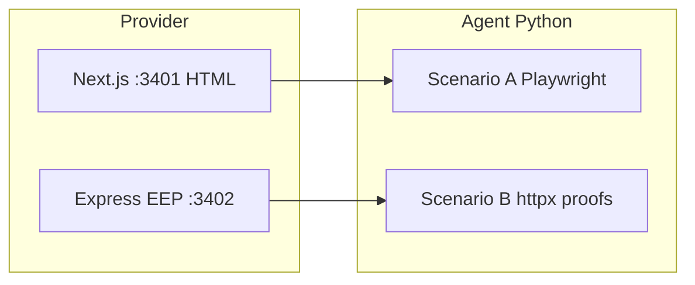

# EEP Realworld Simulation: “Current web (HTML) vs EEP”

Live, **deterministic** demo (no LLM spend) that contrasts:

1. **Scenario A — Current web (HTML):** an agent fetches a bloated Next.js HTML page, hits login/subscription narrative, then uses **Playwright** to read embedded JSON — high bytes, simulated human help, slower.
2. **Scenario B — EEP:** the same “publisher” exposes an **EEP** HTTP API (`@eep-dev/gates`), returning **402** with structured gates; the agent signs an NDA hash (Ed25519), submits a **mock** payment proof, and receives **raw JSON** — low bytes, no human steps.

Google **ADK** (`BaseAgent`) wraps each scenario for tooling compatibility; orchestration calls plain async functions so nothing hits a hosted model.

## Prerequisites

- **Node.js** 20+ and **npm**
- **Python** 3.11+ (`python3`)

## One command

From this directory:

```bash
npm run demo
```

This will:

1. `npm install` in `provider/`
2. Create `agent/.venv`, `pip install -r agent/requirements.txt`, install Playwright Chromium
3. Start **Next.js** on port **3401** and the **EEP Express** publisher on **3402**
4. Run **Scenario A** (in-place **Rich Live** sliding parse viewports for HTML then for `#report-data` JSON, then KPI/segment tables + JSON), then **Scenario B** (EEP gate flow + final JSON), optional pause, then the **comparison** table

**Docs (high-level):** [../docs/guides/realworld-simulation.md](../docs/guides/realworld-simulation.md)

Timing and viewport (readability defaults):

- `DEMO_PHASE_PAUSE_SEC` (default **`1.0`**) — pause between major beats (HTTP → scroll → gates → Playwright → JSON scroll → exports; also between EEP steps).
- `DEMO_EXPORT_SECTION_PAUSE_SEC` (default **`0.5`**) — pause between Scenario A **export** blocks (KPI table → segments → JSON title/body). Set to **`0`** to disable.
- `DEMO_COMPARISON_DELAY_SEC` (default **`1.0`**) — pause after both scenarios finish, **before** the final comparison table. Set to **`0`** to disable.
- `DEMO_VIEWPORT_STEP_SEC` (default **`0.18`**) — delay between scroll frames for JSON (and default baseline).
- `DEMO_HTML_VIEWPORT_STEP_SEC` — HTML stream only; defaults to **half** of `DEMO_VIEWPORT_STEP_SEC` (2× faster than JSON scroll). Override to tune.
- `DEMO_JSON_VIEWPORT_STEP_SEC` — JSON stream; defaults to `DEMO_VIEWPORT_STEP_SEC`.
- `DEMO_VIEWPORT_HEIGHT` — optional fixed viewport height in lines; if unset, height follows terminal rows (taller in **split** mode so the pane fills vertically).
- `DEMO_VIEWPORT_MAX_STEPS` (default **`120`**) — cap on scroll animation steps.
- `DEMO_SCROLL_BUFFER_LINES` — optional cap on generated HTML/JSON scroll buffer lines.

**Side-by-side (parallel):** set `DEMO_SPLIT_SCREEN=1` to run Current web and EEP **at the same time** in two columns (Rich `Layout` + one `Live`). Requires a wide terminal (default minimum **100** columns; override with `DEMO_SPLIT_MIN_COLS`). If the terminal is too narrow, the demo falls back to sequential A → B. The **EEP** column reapplies syntax-style coloring to flow lines (AGENT / EEP / HTTP / JSON-ish lines) because the split capture strips Rich markup per line.

### If servers are already running

```bash
cd agent && PYTHONPATH=. SKIP_SERVER_START=1 .venv/bin/python run_demo.py
```

Set `OLD_WEB_URL` / `EEP_BASE_URL` if you use non-default hosts.

## Layout

| Path | Role |
|------|------|
| `provider/` | Next.js “CorpX” marketing + paywall **HTML**; `eep-server/` Express EEP publisher using `@eep-dev/gates` |
| `agent/` | `run_demo.py` orchestrator; `scenario_a/` Playwright path; `scenario_b/` EEP client; `agent/__agent__.py` ADK entry |

## Architecture



## What is “real” EEP?

- `GET /.well-known/eep.json` manifest
- `GET /eep/state/reports/corpx-q1` → **402** with `gate.402-response`-shaped body from `build402Response`, plus an **agreement** unmet requirement
- `POST` with `gate_proofs`: `agreement` (Ed25519 over `document_hash` string, verified with `tweetnacl`) + `payment` (`token` prefixed `tx_demo_`)
- NDA text and SHA-256 in `eep-server/nda-document.ts` (shared semantics with the whitepaper-style story)

## Twitter / video notes

- Do **not** speed up the terminal recording for the EEP leg — sub-second structured access is the punchline.
- Suggested post: *We taught an agent to satisfy gates, sign an NDA, and pay (simulated) USDC for JSON — no HTML parse. Entity Engagement Protocol (EEP).*

## License

Apache-2.0, consistent with the EEP monorepo.
